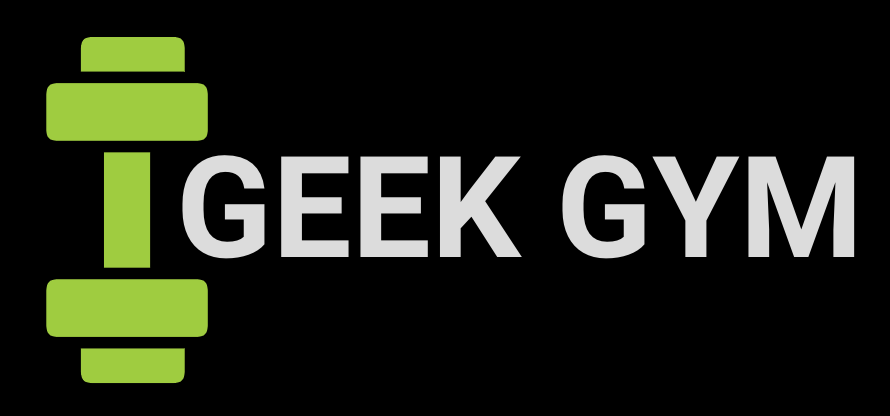
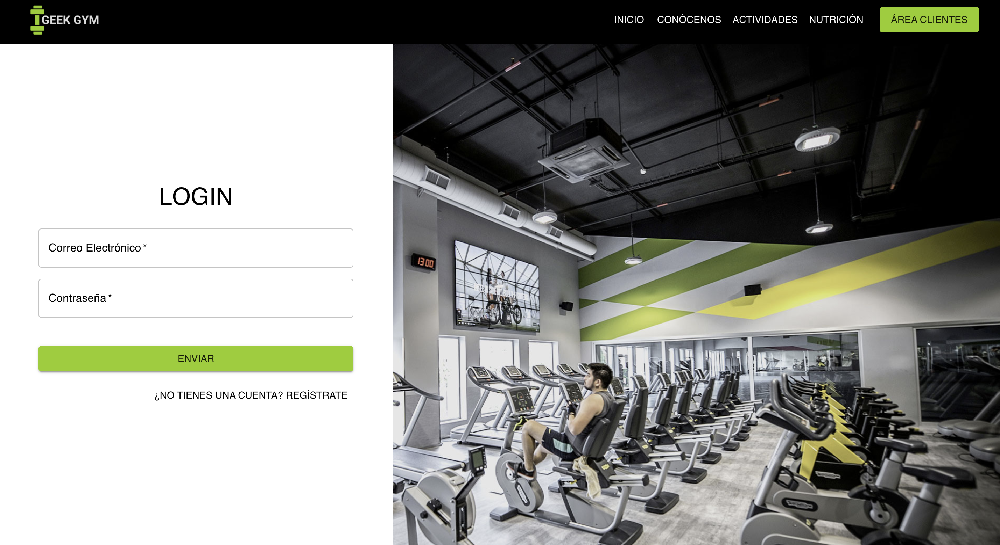
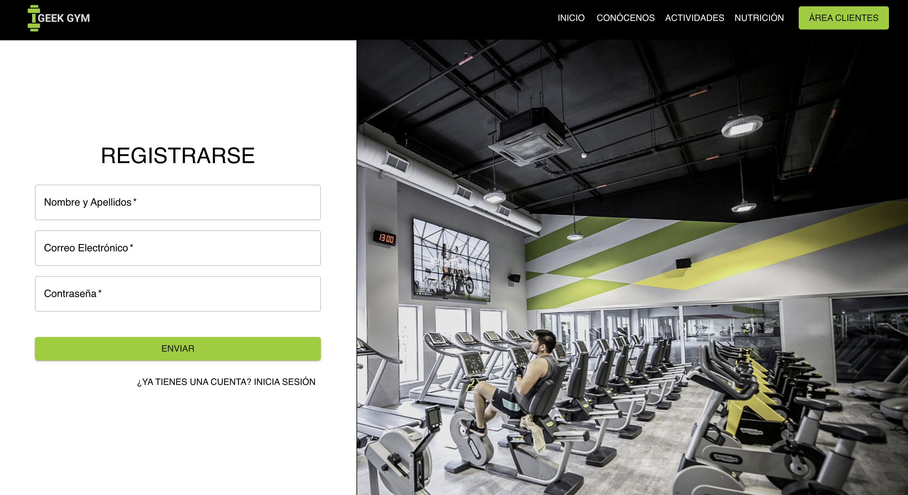
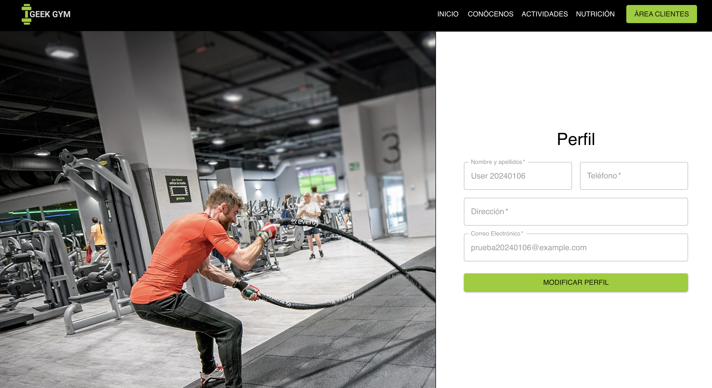
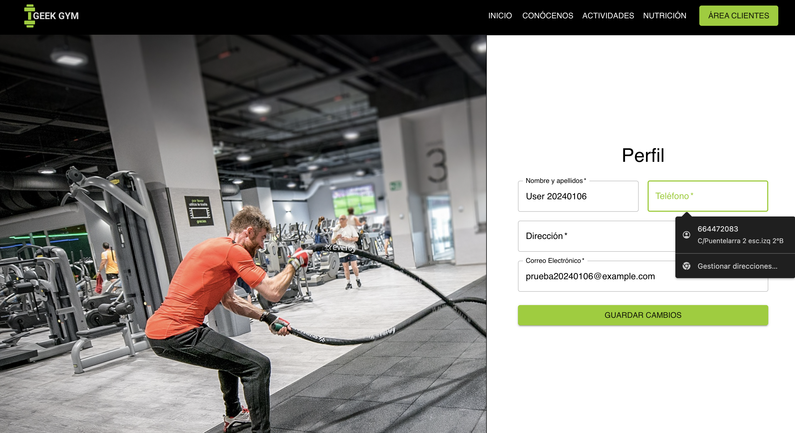

# Geek Gym

¡Bienvenido a Geek Gym, tu nuevo espacio para alcanzar tus metas de bienestar y mantenerte en forma! En Geek Gym, estamos comprometidos a brindarte una experiencia única que va más allá de un simple gimnasio. Nuestro objetivo es ayudarte a construir la mejor versión de ti mismo, tanto física como mentalmente.
Geek Gym es el gimnasio con la sala fitness más grande de Madrid, ubicado estratégicamente en el Ensanche de Vallecas. Nos enorgullece ofrecer instalaciones equipadas con la última innovación, maquinaria de vanguardia y tecnología fitness de primera calidad. En Geek Gym, no solo encontrarás un lugar para entrenar, sino un ambiente increíble y familiar que te motivará en cada paso de tu viaje hacia la salud y el bienestar.

Quiero informaros que Geek Gym está actualmente en una fase inicial de desarrollo, y aunque ya puedes disfrutar de algunas funciones, estoy trabajando arduamente para implementar características adicionales que enriquecerán tu experiencia. En este momento, algunas de las funcionalidades, como "Actividades", "Nutrición" y el área de administración, aún están en proceso de desarrollo.

## Índice

- [Tecnologías](#tectonogías)
- [Instalación](#instalación)
- [Características](#características)
- [Pruebas End-to-End](#pruebas)
- [Contacto](#contacto)

## Tecnologías Utilizadas

Este proyecto utiliza varias bibliotecas y herramientas para facilitar el desarrollo y mejorar la experiencia del usuario. A continuación, se detallan algunas de las principales tecnologías utilizadas:

- **React (v18.2.0):** Biblioteca de JavaScript para construir interfaces de usuario.
- **React Router Dom (v6.20.0):** Enrutador para manejar la navegación en una aplicación React.
- **Material-UI (v5.14.19):** Biblioteca de componentes de React con un diseño basado en Material Design.
- **Redux Toolkit (v1.9.7):** Conjunto de herramientas oficial para la gestión del estado en aplicaciones Redux.
- **React Redux (v8.1.3):** Integración de React con Redux para manejar el estado global de la aplicación.
- **Axios (v1.6.2):** Cliente HTTP para realizar solicitudes a servidores remotos.
- **Redux Persist (v6.0.0):** Middleware para persistir el estado de Redux en el almacenamiento local.
- **Redux Thunk (v2.4.2):** Middleware para manejar acciones asíncronas en Redux.
- **Emotion (v11.11.0):** Librería para el estilo en React.
- **React Swipeable Views (v0.14.0):** Componente para implementar vistas deslizables en aplicaciones React.
- **Cypress (v13.6.2):** Framework de pruebas de extremo a extremo (E2E) para aplicaciones web modernas.

Estas tecnologías han sido seleccionadas para proporcionar una base sólida y mejorar la eficiencia del desarrollo y la experiencia del usuario en la aplicación.

## Instalación

Para instalar y ejecutar este proyecto en tu entorno local, sigue estos pasos:

1. **Clona el Repositorio:**
   git clone https://github.com/SandraSuazo/Frontend_Geek_Gym.git

2. **Instala las Dependencias:**
   npm install

3. **Inicia la Aplicación:**
   npm run dev

4. **Accede a la Aplicación:**
   Abre tu navegador y visita [http://localhost:5173](http://localhost:5173) para ver la aplicación en funcionamiento.

Ahora deberías tener la aplicación instalada y ejecutándose localmente en tu máquina.

## Características

1. **Home:** La página principal presenta Geek Gym de manera atractiva, comenzando con un mensaje clave sobre su singularidad. Destaca la identidad del gimnasio, sus instalaciones de vanguardia y más de 200 actividades mensuales. La sección final resalta las características únicas, enfatizando la flexibilidad y las experiencias memorables. En resumen, la página combina elementos visuales, mensajes persuasivos y detalles distintivos para atraer a los visitantes a unirse a Geek Gym.

2. **Login:** La página de inicio de sesión de Geek Gym proporciona una interfaz limpia y accesible para que los usuarios ingresen sus credenciales. Utiliza un fondo visual atractivo y un formulario. La función handleUserLogin se encarga de la autenticación, actualizando el token de autenticación en el estado global de la aplicación al iniciar sesión con éxito. Además, la página presenta un enlace de navegación para dirigir a los usuarios al proceso de registro si no tienen una cuenta.

3. **Register:** La página de registro de Geek Gym proporciona una interfaz amigable para que los usuarios creen nuevas cuentas. Presenta un diseño similar al de la página de inicio de sesión. La función handleUserRegister maneja el registro del usuario, realizando tanto el registro como el inicio de sesión posterior para proporcionar una experiencia fluida al usuario. El formulario de registro incluye campos para el nombre, correo electrónico y contraseña del usuario. Además, se proporciona un enlace de navegación que dirige a los usuarios a la página de inicio de sesión si ya tienen una cuenta.

4. **Profile:** La página de perfil en Geek Gym ofrece a los usuarios una visión general de su información personal y proporciona la capacidad de editar y actualizar su perfil. La página muestra detalles como el nombre, teléfono, dirección y correo electrónico del usuario. Se integra un formulario de edición de perfil que permite al usuario realizar cambios en su información personal. La estructura del código también incluye componentes reutilizables, como el formulario de edición de perfil (EditProfileForm), que contribuye a un código modular y mantenible.

## Pruebas End-to-End

#### Instala Cypress (si no está instalado)

npm install cypress --save-dev

#### Ejecuta las pruebas E2E

npm run cypress:open

#### Características

El archivo de pruebas E2E incluye una serie de escenarios que cubren la funcionalidad principal de la aplicación Geek Gym. Estos escenarios evalúan la navegación y la interacción del usuario en diferentes páginas, como la barra de navegación, la página de inicio, la página de inicio de sesión, la página de registro y la página de perfil.

Las pruebas incluyen acciones como hacer clic en elementos de la barra de navegación, completar formularios de inicio de sesión y registro, y verificar la visualización correcta de la información en la página de perfil. Estas pruebas E2E ofrecen una cobertura integral de las funciones clave de la aplicación y garantizan que la experiencia del usuario se mantenga robusta y sin problemas.

## Contacto

- Email: sandrasuazo96@gmail.com
- Teléfono: +34 664 472 083
- Linkedin: https://www.linkedin.com/in/sandra-suazo/
